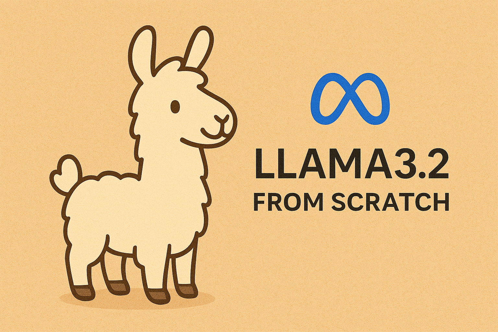
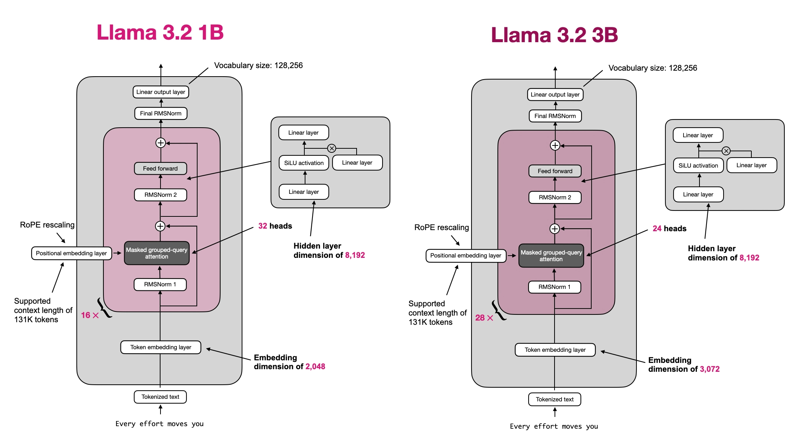
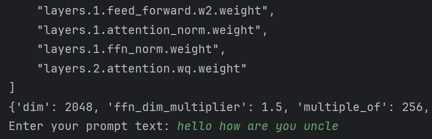
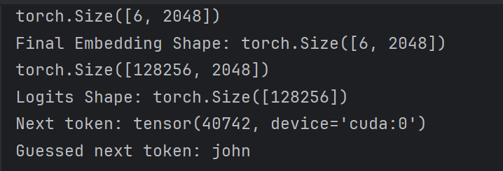

# LLAMA From Scratch

## Getting Started

**1.** Go to Llama website: https://www.llama.com/llama-downloads/

**2.** Select desired model for your choice.

**3.** Send a request to this model, if it is approved, you will be sent a link to download/load model locally.

**4.** Specify the model and tokenizer path in the code.

**5.** Enjoy experimenting & have fun. (Literally)

## Architecture

Llama3.2 1B is a 16 layer decoder transformer with 2048 embedding
dimension, 8192 feed forward dimension and 32 attention heads model. By combining
repeated attention feed forward blocks,RMSNorm layers and a final linear projection the model
learns to generate text autoregressively over 128k+ tokens of context length.
Raw text is converted into integer IDs by a Byte Pair Encoding tokenizer. Each
ID corresponds to a subword or a special token. Embedding
dimension is 2048 which means each token ID is mapped to a learnable
2048-D vector. This layer transforms discrete token indices into
continuous representations that can be processed by the transformer.
Llama3.2 uses rotary positional embeddings to inject position information
into the model. It is a good trick that can be useful for large context lengths to be modeled
effectively. So, each embedding vector, is augmented/rotated based on its position in the sequence. Investigate closely
the complex numbers part to have a better understanding for this, it would make much more sense. After all the layers
a final normalization and map to the logits is used for the next token prediction.

***Example Usage***

Run the program, and enter a prompt as shown in the example.

When you press enter, model would guess the next best possible token,
as "john" shown in below image.

## Warning & Issues
The code & repository is still under development, so sometimes it could give unreasonable results like numbers. Beware of these when experimenting.
